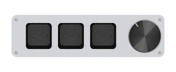

# Description
These AHK Scripts are meant for a basic macropad model that doesn't have layered functionality on the go.
These were made taking into consideration personal use, but may useful to someone else.

Without the script, my macros are set to:
| Key 1      | Key 2      | Key 3      |C.ClockWise | ClockWise  |Knob_Click|
| ---------- | ---------- | ---------- | ---------- | ---------- | -------- |
| Vol_Minus  | Play/Pause | Vol_Plus   | Prev_Track | Next_Track | Mute     |

  
Why these inputs?

 

> [!NOTE]-  
> Highlights information that users should take into account, even when skimming.

> [!TIP]+
> Optional information to help a user be more successful.

> [!IMPORTANT]  
> Crucial information necessary for users to succeed.

> [!WARNING]  
> Critical content demanding immediate user attention due to potential risks.

> [!CAUTION]
> Negative potential consequences of an action.

Those inputs are taken by the script and translated taking into account the tables below

It's quite easy to change the values of the outputs to whatever you'd like to, for doing so, check [V2.0 AHK Documentation](https://www.autohotkey.com/docs/v2/)

### Basic - 2 Modes Toggle
| **Mode**   | Key 1      | Key 2      | Key 3      |C.ClockWise | ClockWise  |Knob_Click|
| ---------- | ---------- | ---------- | ---------- | ---------- | ---------- | -------- |
| **Mode 1** | Prev_Track | Play/Pause | Next_Track | Vol_Minus  | Vol_Plus   | Mode 2   |
| **Mode 2** | Vol_Minus  | Play/Pause | Vol_Plus   | Prev_Track | Next_Track | Mode 1   |

### 5 Modes - Select

| **Mode**    | Key 1      | Key 2      | Key 3      |C.ClockWise | ClockWise  |Knob_Click|
| ----------- | ---------- | ---------- | ---------- | ---------- | ---------- | -------- |
| Select Mode | Mode 1     | Mode 2     | Mode 3     | Mode 4     | Mode 5     | Sel.Mode |
| **Mode 1**  | Prev_Track | Play/Pause | Next_Track | Vol_Minus  | Vol_Plus   | Sel.Mode |
| **Mode 2**  | Vol_Minus  | Play/Pause | Vol_Plus   | Prev_Track | Next_Track | Sel.Mode |
| **Mode 3**  |            |            |            |            |            | Sel.Mode |
| **Mode 4**  |            |            |            |            |            | Sel.Mode |
| **Mode 5**  |            |            |            |            |            | Sel.Mode |
